# Chat Agent PoC - System Architecture

## 🏗️ Overview

The Chat Agent PoC is a conversational AI workflow management system built with a clean microservices architecture. The system enables users to create and manage business workflows through natural language conversations, automatically converting business requirements into technical workflow specifications using a JSON DSL.

## 🎯 Architecture Principles

- **Separation of Concerns**: Each service has a single, well-defined responsibility
- **Protocol-Based Integration**: Services communicate through standardized protocols (HTTP REST, MCP)
- **Type Safety**: Full Pydantic schema validation across all service boundaries
- **Business Language First**: AI maintains business terminology, never exposes technical implementation
- **Shared Component Reuse**: Common schemas, error handling, and configuration patterns

## 📊 System Architecture Diagram

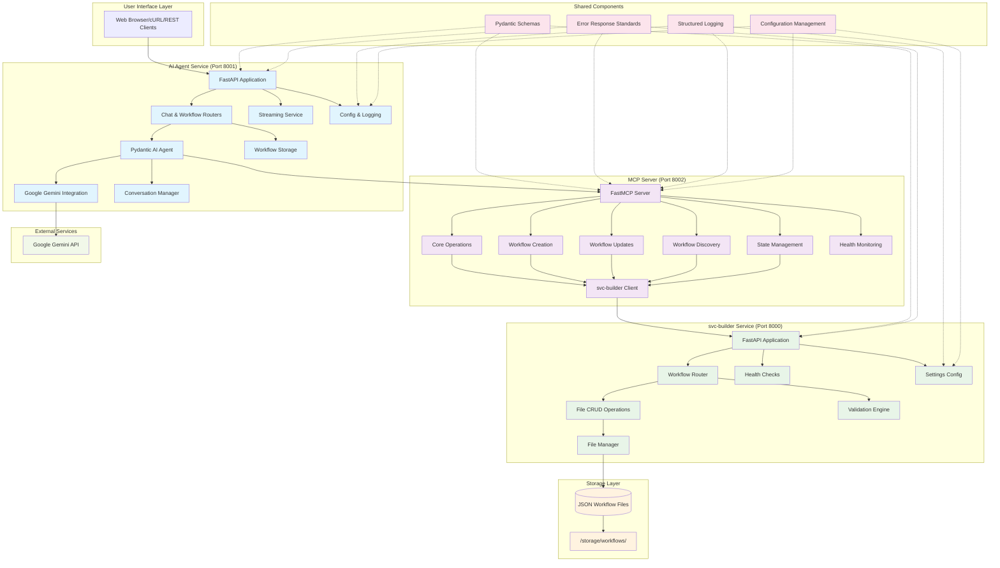

## 🔄 Request Flow Sequence

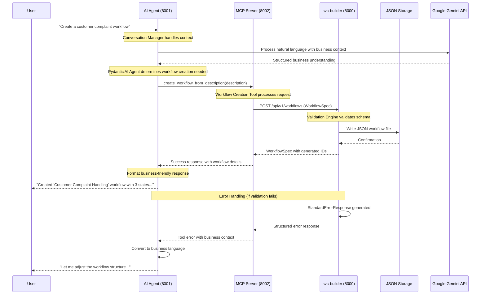

## 🏢 Service Responsibilities

### 🤖 AI Agent Service (Port 8001)
**Role**: Conversational interface and business logic coordinator

**Core Responsibilities**:
- Natural language conversation management with users
- Integration with Google Gemini for AI processing
- Business workflow conceptualization and explanation
- MCP tool orchestration for workflow operations
- Streaming response support for real-time interactions
- In-memory conversation history management

**Key Components**:
- **Pydantic AI Agent**: Core conversational AI with business persona
- **Conversation Manager**: Context and history tracking
- **Streaming Service**: Real-time response delivery
- **Workflow Storage**: In-memory workflow caching
- **Error Handlers**: Business-friendly error conversion

**Technologies**: FastAPI, Pydantic AI, Google Gemini API, Python 3.10

---

### 🌉 MCP Server (Port 8002)
**Role**: Protocol bridge and workflow tool provider

**Core Responsibilities**:
- Model Context Protocol (MCP) server implementation
- Workflow management tool registration and execution
- Translation between AI Agent requests and svc-builder API
- Business logic abstraction for workflow operations
- Health monitoring and system diagnostics

**Tool Modules** (After Code Cleanup):
1. **Core Operations** (125 lines): CRUD, validation, listing
2. **Workflow Creation** (296 lines): Template-based and custom creation
3. **Workflow Updates** (307 lines): Structure and permission modifications
4. **Workflow Discovery** (213 lines): Search and exploration tools
5. **State Management** (183 lines): State and action management
6. **Health Monitoring** (35 lines): System health checks

**Technologies**: FastMCP, HTTP Client, Python 3.10

---

### 📁 svc-builder Service (Port 8000)
**Role**: JSON DSL file management and persistence

**Core Responsibilities**:
- JSON workflow file CRUD operations
- Pydantic schema validation and type safety
- File system management and organization
- Workflow specification persistence
- Data integrity and validation enforcement

**Key Components**:
- **File Manager**: JSON file operations with atomic writes
- **Validation Engine**: Multi-layer Pydantic validation
- **Workflow Router**: REST API endpoints
- **Health Checks**: Service availability monitoring
- **Error Handlers**: Standardized error response formatting

**Technologies**: FastAPI, Pydantic, File I/O, Python 3.10

## 🔗 Integration Architecture

### Protocol Stack
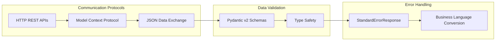

### Network Architecture
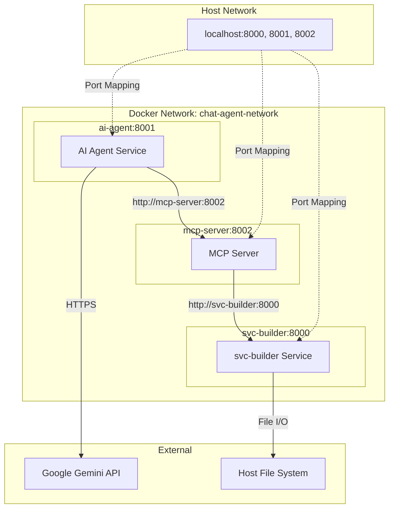

## 🛠️ Shared Component Architecture

### Shared Module Structure
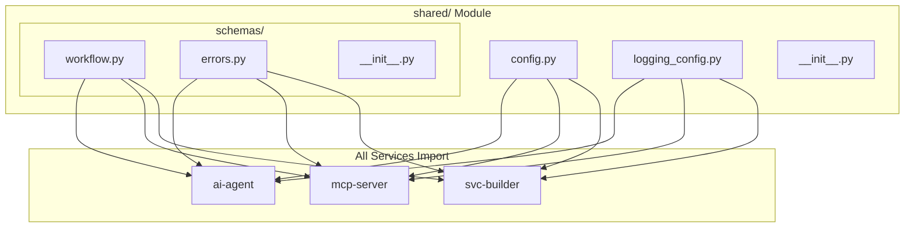

### Configuration Management
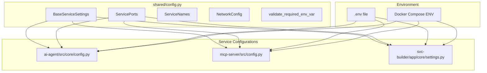

## 📦 Data Flow Architecture

### Workflow Creation Flow
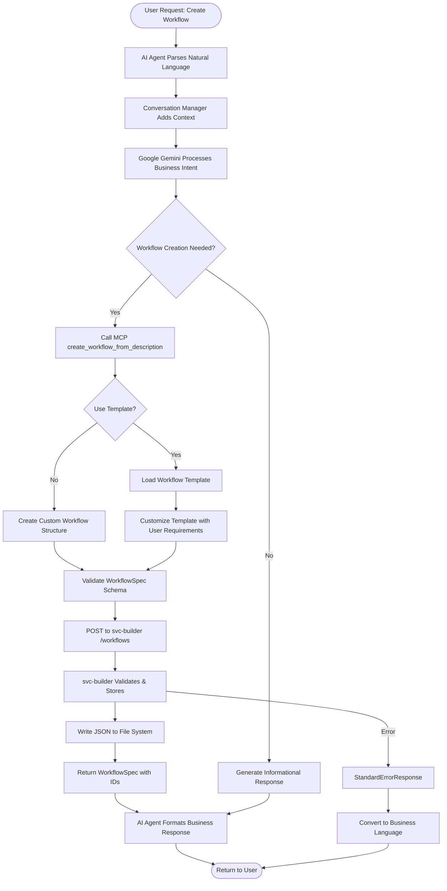

### Error Handling Flow
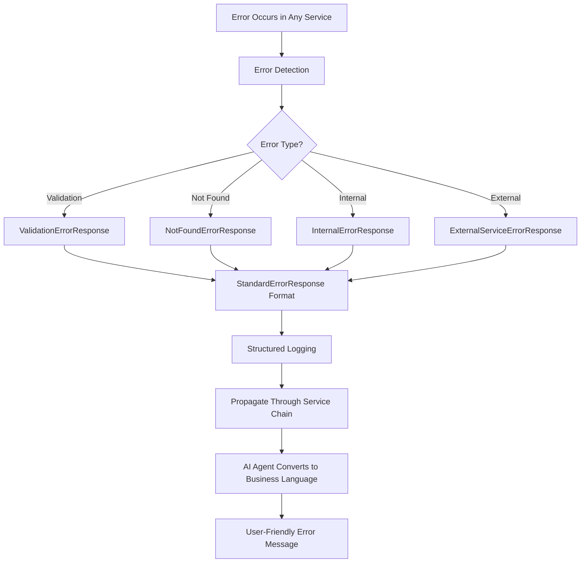

## 🧪 Testing Architecture

### Test Strategy Overview
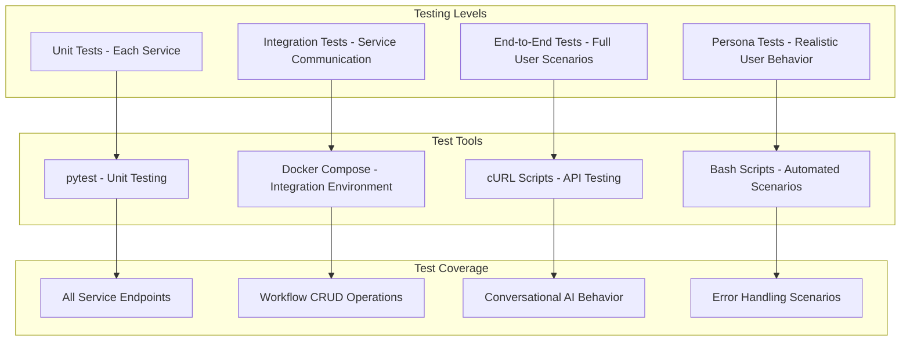

## 🚀 Deployment Architecture

### Container Orchestration
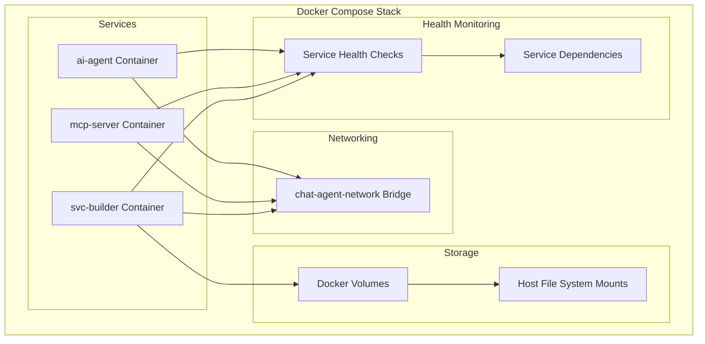

## 📈 Performance Characteristics

### System Metrics
- **Service Startup Time**: ~10-15 seconds (full stack)
- **API Response Time**: <200ms (typical workflow operations)
- **Concurrent Conversations**: Supported (stateless design)
- **Memory Footprint**: ~300MB total (all services)
- **Storage Efficiency**: JSON files, ~2-5KB per workflow

### Scalability Considerations
- **Horizontal Scaling**: Each service can be scaled independently
- **State Management**: Conversations stored in-memory (session-based)
- **Database Ready**: File storage easily replaceable with database
- **Load Balancing**: FastAPI services are load balancer compatible

## 🔒 Security Architecture

### Security Layers
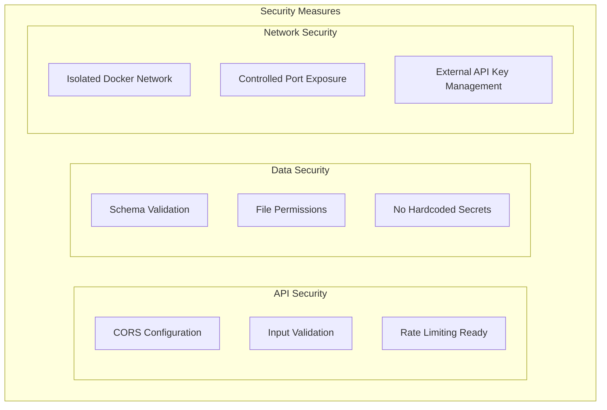

## 🎯 Code Quality Achievements

### Recent Improvements (Code Cleanup Phase)
1. **Eliminated sys.path.append() hacks** - Proper Python package structure
2. **Modular MCP Server** - Split 1169 lines into 6 organized modules (~150-300 lines each)
3. **Standardized Error Handling** - Consistent error responses across all services
4. **Shared Configuration Management** - Centralized settings with validation
5. **Structured Logging Framework** - JSON logging for observability
6. **Type Safety** - Full Pydantic v2 compatibility throughout

### Architecture Quality Metrics
- **Separation of Concerns**: ✅ Each service has single responsibility
- **DRY Principle**: ✅ Shared components eliminate duplication
- **Type Safety**: ✅ End-to-end Pydantic validation
- **Error Handling**: ✅ Standardized error responses
- **Testability**: ✅ Clean interfaces and dependency injection
- **Maintainability**: ✅ Modular structure with clear boundaries

---

This architecture supports the current PoC requirements while providing a solid foundation for scaling to a production MVP with features like real-time streaming, enhanced UI integration, and workflow execution capabilities.