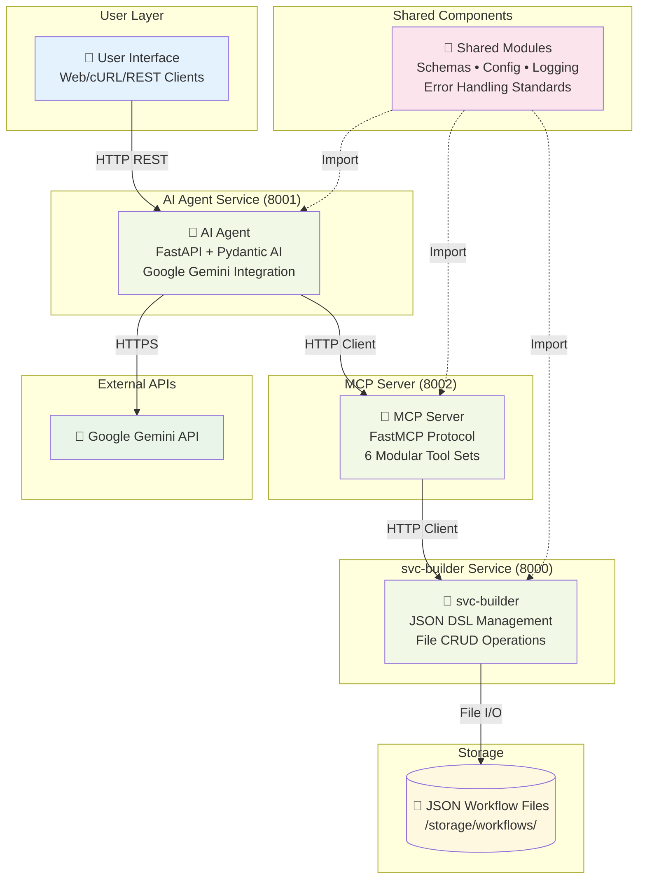

# Chat Agent PoC - AI Workflow Management System

A Proof-of-Concept system demonstrating conversational AI for workflow creation and management through natural language. Users can create, modify, and understand business workflows using plain English conversations that automatically generate technical workflow specifications.

## 🏗️ System Architecture

This PoC features a clean microservices architecture with standardized protocols, shared components, and comprehensive error handling:



### **Service Responsibilities**

1. **🤖 AI Agent (8001)** - Conversational interface with business persona, Pydantic AI + Gemini integration
2. **🌉 MCP Server (8002)** - Model Context Protocol bridge with 6 organized tool modules
3. **📁 svc-builder (8000)** - JSON workflow file management with validation and persistence

### **Recent Architecture Improvements** ✨

The system has undergone comprehensive code cleanup and modernization:

- **🏗️ Modular Architecture**: Split monolithic MCP server (1169 lines → 6 organized modules)
- **🔧 Shared Components**: Centralized configuration, logging, and error handling
- **📦 Proper Package Structure**: Eliminated `sys.path.append()` hacks with `pyproject.toml`
- **🛡️ Standardized Error Handling**: Consistent error responses across all services
- **📊 Structured Logging**: JSON logging framework for observability
- **⚙️ Configuration Management**: Unified settings with validation and environment support

> See [ARCHITECTURE.md](ARCHITECTURE.md) for detailed technical documentation with comprehensive Mermaid diagrams.

## 🚀 Quick Start

### **Prerequisites**
- Python 3.10+
- Docker and Docker Compose
- Google API key for Gemini (see setup instructions below)

### **1. Clone and Setup**
```bash
git clone <repository-url>
cd chat-agent
cp .env.example .env
```

### **2. Configure Google API Key**
1. Get a Google Gemini API key from [Google AI Studio](https://makersuite.google.com/app/apikey)
2. Edit the `.env` file and replace `your-google-gemini-api-key-here` with your actual API key:
```bash
GOOGLE_API_KEY=your-actual-api-key-here
```

**Security Note**: Never commit your actual API key to version control. The `.env` file is already included in `.gitignore`.

### **3. Run with Docker Compose**
```bash
# Build and start all services
docker-compose up --build

# Or run in background
docker-compose up -d --build
```

### **4. Verify Services**
```bash
# Check all services are running
docker-compose ps

# Health checks
curl http://localhost:8000/api/v1/health  # svc-builder
curl http://localhost:8001/api/v1/health  # AI Agent
```

### **5. Test the System**

**Option A: Automated Conversation Testing (Recommended)**
```bash
# Run interactive test menu
./run_tests.sh

# Or run specific scenarios directly
./test_conversations.sh all           # Full test suite
./test_conversations.sh manager       # Business manager persona
./test_conversations.sh novice        # Learning user persona
./test_conversations.sh verify        # Check created workflows
```

**Option B: Manual Testing**
```bash
# Test workflow creation through conversation
curl -X POST "http://localhost:8001/api/v1/chat" \
  -H "Content-Type: application/json" \
  -d '{"message": "I need a workflow for handling customer complaints"}'

# Follow up to actually create the workflow
curl -X POST "http://localhost:8001/api/v1/chat" \
  -H "Content-Type: application/json" \
  -d '{
    "message": "Please create this customer complaint workflow for me.",
    "conversation_id": "conversation-id-from-previous-response"
  }'

# Verify the workflow was created
curl http://localhost:8000/api/v1/workflows
```

## 📡 API Documentation

### **AI Agent (Port 8001)**

#### **Chat with Agent**
```bash
POST /api/v1/chat
```

**Request Options:**

1. **General Chat:**
```json
{
  "message": "Hello! What can you help me with?"
}
```

2. **Chat with Stored Workflow:**
```json
{
  "message": "What can I do from the reportado state?",
  "workflow_id": "wf_incidentes"
}
```

3. **Chat with Full Workflow Spec:**
```json
{
  "message": "Explain this workflow",
  "workflow_spec": {
    "specId": "custom_workflow",
    "name": "My Custom Workflow",
    "states": [...],
    "actions": [...],
    ...
  }
}
```

**Response:**
```json
{
  "response": "This workflow manages incident resolution...",
  "conversation_id": "uuid-string",
  "prompt_count": 1,
  "mcp_tools_used": ["get_workflow", "get_workflow_states"],
  "workflow_source": "stored_workflow:wf_incidentes"
}
```

#### **Other Endpoints:**
- `GET /api/v1/health` - Service health
- `GET /api/v1/workflows` - List stored workflows (in-memory)
- `GET /api/v1/conversations/{id}/history` - Conversation history
- `DELETE /api/v1/conversations/{id}` - Clear conversation

### **svc-builder (Port 8000)**

#### **Workflow Management**
```bash
GET    /api/v1/workflows           # List all workflows
GET    /api/v1/workflows/{spec_id} # Get specific workflow
POST   /api/v1/workflows           # Create new workflow
PUT    /api/v1/workflows/{spec_id} # Update workflow
DELETE /api/v1/workflows/{spec_id} # Delete workflow
POST   /api/v1/workflows/{spec_id}/validate # Validate workflow
```

## 🧪 Testing & Development

### **Automated Testing Scripts**

The system includes comprehensive testing scripts that simulate real user conversations:

#### **🎭 User Personas Tested**

**1. Experienced Business Manager (Sarah)**
- Operations Manager at logistics company
- Knows exact requirements and business processes
- Uses specific terminology and clear requirements
- Creates multiple workflows efficiently
- Tests: Supplier onboarding and customer returns workflows

**2. Novice User (Mike)**
- Junior Project Coordinator learning workflow design
- Understands their work but not formal processes
- Needs guidance and iterative improvement
- Learns workflow concepts through conversation
- Tests: Project management workflow with modifications

#### **🚀 Running Tests**

```bash
# Interactive test menu with all options
./run_tests.sh

# Direct scenario testing
./test_conversations.sh all       # Full test suite (both personas)
./test_conversations.sh manager   # Only business manager scenario
./test_conversations.sh novice    # Only novice user scenario
./test_conversations.sh verify    # Verify created workflows
```

The test script will:
- ✅ Check service health
- 🎭 Simulate realistic user conversations
- 📊 Verify workflow creation
- 📈 Provide analysis of AI behavior with different user types

### **Manual Testing Examples**

#### **1. Create New Workflow:**
```bash
# Start conversation about workflow needs
curl -X POST "http://localhost:8001/api/v1/chat" \
  -H "Content-Type: application/json" \
  -d '{"message": "I need a workflow for document approval process"}'

# AI suggests workflow structure, request creation
curl -X POST "http://localhost:8001/api/v1/chat" \
  -H "Content-Type: application/json" \
  -d '{
    "message": "Yes, please create this workflow in the system",
    "conversation_id": "conversation-id-from-response"
  }'
```

#### **2. Create from Template:**
```bash
curl -X POST "http://localhost:8001/api/v1/chat" \
  -H "Content-Type: application/json" \
  -d '{"message": "Create a task management workflow for me"}'
```

#### **3. Custom Workflow Creation:**
```bash
curl -X POST "http://localhost:8001/api/v1/chat" \
  -H "Content-Type: application/json" \
  -d '{"message": "I need a workflow with states: New, In Progress, Testing, and Done. Create it for me."}'
```

#### **4. Explore Existing Workflows:**
```bash
curl -X POST "http://localhost:8001/api/v1/chat" \
  -H "Content-Type: application/json" \
  -d '{
    "message": "What is the incident management workflow about?",
    "workflow_id": "wf_incidentes"
  }'
```

### **Pre-loaded Sample Workflows**

The system comes with 3 sample workflows:

1. **`wf_incidentes`** - Incident Management (3 states, 2 actions)
2. **`wf_approval`** - Document Approval (4 states, 3 actions)
3. **`wf_tasks`** - Task Management (5 states, 5 actions)

### **Running Local Development**

#### **Individual Services:**

**svc-builder:**
```bash
cd svc-builder
python -m venv venv && source venv/bin/activate
pip install -r requirements.txt
PYTHONPATH=/Users/alelo/Documents/Luke/chat-agent python -m uvicorn app.main:app --host 0.0.0.0 --port 8000 --reload
```

**MCP Server:**
```bash
cd mcp-server
python -m venv venv && source venv/bin/activate
pip install -r requirements.txt
python src/server.py
```

**AI Agent:**
```bash
cd ai-agent
python -m venv venv && source venv/bin/activate
pip install -r requirements.txt
PYTHONPATH=/Users/alelo/Documents/Luke/chat-agent python -m uvicorn src.main:app --host 0.0.0.0 --port 8001 --reload
```

### **Integration Testing**
```bash
# Run comprehensive integration tests
python tests/integration_test.py

# Test individual components
cd ai-agent && pytest tests/
cd svc-builder && pytest tests/
cd mcp-server && pytest tests/
```

## 📁 Project Structure

```
chat-agent/
├── shared/                          # 🔧 Shared Components (NEW!)
│   ├── schemas/
│   │   ├── workflow.py              # WorkflowSpec and related models
│   │   ├── errors.py                # StandardErrorResponse schemas
│   │   └── __init__.py              # Unified exports
│   ├── config.py                    # BaseServiceSettings & utilities
│   ├── logging_config.py            # Structured JSON logging framework
│   └── __init__.py
├── ai-agent/                        # 🤖 Conversational AI Agent
│   ├── src/
│   │   ├── agents/                  # Pydantic AI conversation agents
│   │   ├── api/                     # FastAPI routers (chat, workflow)
│   │   ├── core/                    # Config, streaming, error handling
│   │   ├── tools/                   # MCP client integration
│   │   ├── data/                    # In-memory storage & conversation mgmt
│   │   └── main.py
│   ├── tests/
│   ├── requirements.txt
│   ├── Dockerfile
│   └── README.md
├── mcp-server/                      # 🌉 MCP Protocol Server (REFACTORED!)
│   ├── src/
│   │   ├── tools/                   # 6 Organized Tool Modules:
│   │   │   ├── core_operations.py   # CRUD, validation, listing (125 lines)
│   │   │   ├── workflow_creation.py # Template & custom creation (296 lines)
│   │   │   ├── workflow_updates.py  # Structure & permission updates (307 lines)
│   │   │   ├── workflow_discovery.py# Search & exploration (213 lines)
│   │   │   ├── state_management.py  # State & action management (183 lines)
│   │   │   └── health_monitoring.py # System health checks (35 lines)
│   │   ├── server.py                # FastMCP server registration (91 lines)
│   │   ├── svc_client.py            # HTTP client for svc-builder
│   │   └── config.py                # Standardized configuration
│   ├── tests/
│   ├── requirements.txt
│   └── Dockerfile
├── svc-builder/                     # 📁 JSON DSL File Management
│   ├── app/
│   │   ├── api/                     # FastAPI workflow router
│   │   ├── core/                    # File manager, error handlers, settings
│   │   └── main.py
│   ├── storage/workflows/           # JSON file storage directory
│   ├── tests/
│   ├── requirements.txt
│   └── Dockerfile
├── tests/
│   └── integration_test.py          # End-to-end tests
├── pyproject.toml                   # 📦 Python package configuration (NEW!)
├── test_conversations.sh            # Automated persona testing script
├── run_tests.sh                     # Interactive test runner
├── docker-compose.yml               # Full system orchestration
├── .env.example                     # Environment configuration template
├── ARCHITECTURE.md                  # 📊 Technical architecture with Mermaid diagrams (NEW!)
├── AI-AGENT.md                      # AI Agent implementation details
├── RESEARCH.md                      # Real-time communication research
├── CLAUDE.md                        # Claude Code development guidance
└── README.md                        # This file
```

## 🔧 Configuration

### **Environment Variables**

Key configuration options (see `.env.example`):

```bash
# AI Configuration
GOOGLE_API_KEY=your-gemini-api-key     # Google Gemini API key
AI_MODEL=gemini-2.5-flash-lite         # AI model to use

# Service Ports
AI_AGENT_PORT=8001                     # AI Agent service port
MCP_SERVER_PORT=8002                   # MCP Server port
SERVICE_PORT=8000                      # svc-builder port

# Features
MAX_CONVERSATION_LENGTH=15             # Conversation history limit
LOG_LEVEL=INFO                         # Logging level
```

### **Docker Network**

Services communicate via Docker network:
- **ai-agent** connects to **mcp-server** at `http://mcp-server:8002`
- **mcp-server** connects to **svc-builder** at `http://svc-builder:8000`
- All services expose ports to host for testing

## 🎯 Key Features Demonstrated

### **1. Conversational Workflow Creation**
- **Business Language**: Create workflows using natural business terms
- **Auto-Generation**: Automatically generates technical IDs, slugs, and permissions
- **Template Support**: Built-in templates for common workflow patterns
- **Incremental Building**: Add states and actions through conversation

### **2. AI-Powered Business Consultant**
- **Business Persona**: AI speaks as a process consultant, not a technical system
- **Natural Flow**: Proposes logical workflow structures based on business needs
- **No Technical Exposure**: Never mentions JSON, schemas, or validation errors
- **Context Awareness**: Maintains conversation history and context

### **3. Robust Validation & Integration**
- **Pydantic Schemas**: Type-safe workflow specifications with proper alias handling
- **Validation Pipeline**: Multi-layer validation (FastAPI → Pydantic → Business Logic)
- **Error Recovery**: Graceful handling of validation issues without exposing technical details
- **Shared Models**: Consistent data structures across all services

### **4. Modern Architecture Patterns**
- **MCP Protocol**: Standardized tool integration with FastMCP
- **Microservices**: Containerized services with clear responsibilities
- **Type Safety**: Full TypeScript-like type checking in Python
- **Production Ready**: Health checks, logging, and monitoring foundations

## 🔍 Troubleshooting

### **Common Issues**

#### **Import Errors**
- Ensure `PYTHONPATH` is set correctly when running locally
- Use Docker Compose for simplified deployment

#### **MCP Connection Issues**
- Verify all services are running: `docker-compose ps`
- Check service dependencies in docker-compose.yml
- MCP Server must start after svc-builder

#### **API Rate Limits**
- Google Gemini API has rate limits
- Adjust request frequency for testing
- Consider using test mode for development

#### **Port Conflicts**
- Default ports: 8000 (svc-builder), 8001 (AI Agent), 8002 (MCP Server)
- Change ports in docker-compose.yml if needed

### **Debugging Commands**

```bash
# Check service logs
docker-compose logs ai-agent
docker-compose logs mcp-server
docker-compose logs svc-builder

# Restart specific service
docker-compose restart ai-agent

# Rebuild and restart
docker-compose up --build ai-agent
```

## 🚀 Next Steps (December MVP)

This PoC provides the foundation for the December MVP with:

1. **Real-time Streaming**: Integration points ready for WebSocket/SSE
2. **Enhanced UI**: FastAPI endpoints ready for React frontend
3. **Workflow Execution**: Extend from configuration to runtime management
4. **User Management**: Add authentication and multi-tenancy
5. **Production Scaling**: Database integration and horizontal scaling

See `RESEARCH.md` for detailed real-time communication implementation plans.

## 📄 Documentation

- **[AI-AGENT.md](AI-AGENT.md)** - Detailed AI Agent architecture and implementation plan
- **[RESEARCH.md](RESEARCH.md)** - Real-time communication research for December MVP
- **[Setup.md](Setup.md)** - Original PoC requirements and specifications

## 🤝 Contributing

This is a PoC system demonstrating the integration of:
- **Pydantic AI** for conversational agents
- **Model Context Protocol** for tool integration
- **FastAPI** for high-performance APIs
- **Docker** for microservice orchestration

For production deployment, consider:
- Database integration for persistence
- Authentication and authorization
- Monitoring and observability
- Error handling and recovery
- Performance optimization

---

**Built with:** Python 3.10, FastAPI, Pydantic AI, Docker, MCP Protocol
**PoC Status:** ✅ Complete - Conversational workflow creation and management fully working
**Next Phase:** December MVP with real-time streaming capabilities

## 🎯 Workflow Creation Examples

### **Available Workflow Templates**
- **Approval Process**: Submit → Review → Approve/Reject
- **Incident Management**: Report → Investigate → Resolve
- **Task Management**: Create → In Progress → Complete
- **Document Review**: Draft → Review → Publish
- **Request Handling**: Submit → Process → Fulfill

### **Example Conversation Flow**

**User**: "I need a workflow for handling customer complaints"

**AI**: "Excellent! Customer complaint handling is crucial for service quality. I'll design a process that ensures every complaint gets proper attention:

1. **Received** - When the complaint first comes in
2. **Under Investigation** - While your team looks into the details
3. **Resolved** - When you've addressed the customer's concern

This process will help you track response times and ensure nothing falls through the cracks. Would you like me to create this workflow?"

**User**: "Yes, please create this workflow in the system."

**AI**: "I've created the 'Customer Complaint Handling' workflow for you! Here's what was generated:

- **States**: Received → Under Investigation → Resolved
- **Actions**: Lodge Complaint, Investigate Complaint
- **Permissions**: Automatically generated for each action

The workflow is now ready for use in your system!"

### **Technical Details Generated**
```json
{
  "specId": "wf_customer_complaint_handling",
  "name": "Customer Complaint Handling",
  "states": [
    {"slug": "received", "name": "Received", "type": "initial"},
    {"slug": "under_investigation", "name": "Under Investigation", "type": "intermediate"},
    {"slug": "resolved", "name": "Resolved", "type": "final"}
  ],
  "actions": [
    {"slug": "lodge_complaint", "from": "received", "to": "under_investigation", "permission": "lodge_complaint_perm"},
    {"slug": "investigate_complaint", "from": "under_investigation", "to": "resolved", "permission": "investigate_complaint_perm"}
  ],
  "permissions": [
    {"slug": "lodge_complaint_perm", "description": "Permission to lodge complaint"},
    {"slug": "investigate_complaint_perm", "description": "Permission to investigate complaint"}
  ]
}
```