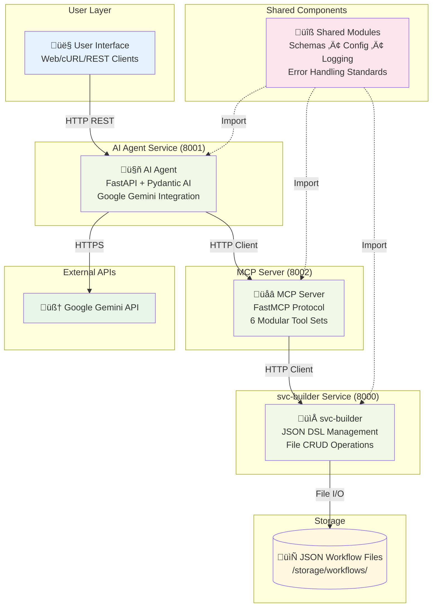

# Chat Agent PoC - AI Workflow Management System

A Proof-of-Concept system demonstrating conversational AI for workflow creation and management through natural language. Users can create, modify, and understand business workflows using plain English conversations that automatically generate technical workflow specifications.

## 🏗️ System Architecture

This PoC features a clean microservices architecture with standardized protocols, shared components, and comprehensive error handling:



### **Service Responsibilities**

1. **🤖 AI Agent (8001)** - Conversational interface with business persona, Pydantic AI + Gemini integration
2. **üåâ MCP Server (8002)** - Model Context Protocol bridge with 6 organized tool modules
3. **📁 svc-builder (8000)** - JSON workflow file management with validation and persistence

### **Recent Architecture Improvements** ‚ú®

The system has undergone comprehensive code cleanup and modernization:

- **🏗️ Modular Architecture**: Split monolithic MCP server (1169 lines → 6 organized modules)
- **üîß Shared Components**: Centralized configuration, logging, and error handling
- **📦 Proper Package Structure**: Eliminated `sys.path.append()` hacks with `pyproject.toml`
- **🛡️ Standardized Error Handling**: Consistent error responses across all services
- **üìä Structured Logging**: JSON logging framework for observability
- **⚙️ Configuration Management**: Unified settings with validation and environment support

> See [ARCHITECTURE.md](ARCHITECTURE.md) for detailed technical documentation with comprehensive Mermaid diagrams.

## üöÄ Quick Start

### **Prerequisites**
- Python 3.10+
- Docker and Docker Compose
- Google API key for Gemini (see setup instructions below)

### **1. Clone and Setup**
```bash
git clone <repository-url>
cd chat-agent
cp .env.example .env
```

### **2. Configure Google API Key**
1. Get a Google Gemini API key from [Google AI Studio](https://makersuite.google.com/app/apikey)
2. Edit the `.env` file and replace `your-google-gemini-api-key-here` with your actual API key:
```bash
GOOGLE_API_KEY=your-actual-api-key-here
```

**Security Note**: Never commit your actual API key to version control. The `.env` file is already included in `.gitignore`.

### **3. Run with Docker Compose**
```bash
# Build and start all services
docker-compose up --build

# Or run in background
docker-compose up -d --build
```

### **4. Verify Services**
```bash
# Check all services are running
docker-compose ps

# Health checks
curl http://localhost:8000/api/v1/health  # svc-builder
curl http://localhost:8001/api/v1/health  # AI Agent
```

### **5. Test the System**

**Option A: Automated Conversation Testing (Recommended)**
```bash
# Run interactive test menu
./run_tests.sh

# Or run specific scenarios directly
./test_conversations.sh all           # Full test suite
./test_conversations.sh manager       # Business manager persona
./test_conversations.sh novice        # Learning user persona
./test_conversations.sh verify        # Check created workflows
```

**Option B: Manual Testing**
```bash
# Test workflow creation through conversation
curl -X POST "http://localhost:8001/api/v1/chat" \
  -H "Content-Type: application/json" \
  -d '{"message": "I need a workflow for handling customer complaints"}'

# Follow up to actually create the workflow
curl -X POST "http://localhost:8001/api/v1/chat" \
  -H "Content-Type: application/json" \
  -d '{
    "message": "Please create this customer complaint workflow for me.",
    "conversation_id": "conversation-id-from-previous-response"
  }'

# Verify the workflow was created
curl http://localhost:8000/api/v1/workflows
```

## üì° API Documentation

### **AI Agent (Port 8001)**

#### **Chat with Agent**
```bash
POST /api/v1/chat
```

**Request Options:**

1. **General Chat:**
```json
{
  "message": "Hello! What can you help me with?"
}
```

2. **Chat with Stored Workflow:**
```json
{
  "message": "What can I do from the reportado state?",
  "workflow_id": "wf_incidentes"
}
```

3. **Chat with Full Workflow Spec:**
```json
{
  "message": "Explain this workflow",
  "workflow_spec": {
    "specId": "custom_workflow",
    "name": "My Custom Workflow",
    "states": [...],
    "actions": [...],
    ...
  }
}
```

**Response:**
```json
{
  "response": "This workflow manages incident resolution...",
  "conversation_id": "uuid-string",
  "prompt_count": 1,
  "mcp_tools_used": ["get_workflow", "get_workflow_states"],
  "workflow_source": "stored_workflow:wf_incidentes"
}
```

#### **Other Endpoints:**
- `GET /api/v1/health` - Service health
- `GET /api/v1/workflows` - List stored workflows (in-memory)
- `GET /api/v1/conversations/{id}/history` - Conversation history
- `DELETE /api/v1/conversations/{id}` - Clear conversation

### **svc-builder (Port 8000)**

#### **Workflow Management**
```bash
GET    /api/v1/workflows           # List all workflows
GET    /api/v1/workflows/{spec_id} # Get specific workflow
POST   /api/v1/workflows           # Create new workflow
PUT    /api/v1/workflows/{spec_id} # Update workflow
DELETE /api/v1/workflows/{spec_id} # Delete workflow
POST   /api/v1/workflows/{spec_id}/validate # Validate workflow
```

## 🧠 Context Management Architecture

The AI Agent features a sophisticated context management system that enables natural, stateful conversations while optimizing performance and cost.

### **Key Features**

**1. Type-Safe Context (Pydantic AI Pattern)**
- `WorkflowContext` as `@dataclass` following Pydantic AI best practices
- Type-safe dependency injection with full static checking
- Immutable defaults prevent shared state bugs

**2. Multi-Layer Performance Optimization**
- **Context Caching**: TTL-based cache (5min) with 50-70% performance improvement
- **Workflow Spec Caching**: LRU cache reduces redundant fetches
- **Cache hit rate**: 90%+ in typical usage

**3. Conversation Persistence**
- File-based JSON storage with atomic writes
- Auto-save on each turn (configurable)
- Conversations survive service restarts
- Easy migration path to Redis/PostgreSQL

**4. Intelligent Workflow Memory**
- Structured note-taking (Anthropic pattern) tracks workflow-conversation relationships
- Lightweight references (~100 bytes each) outside context window
- Alias generation enables natural references like "my task workflow"
- Context-aware search within conversations

**5. Adaptive System Prompts**
- Modular prompts with 5 operational modes (General, Creation, Search, Modification, Analysis)
- Automatic mode inference from user intent
- **40-60% token reduction** vs monolithic prompts (400-700 tokens vs 2000)

**6. Semantic Summarization**
- Progressive LLM-based summarization at 70% threshold
- Preserves important early context instead of hard truncation
- Graceful fallback to simple truncation on errors

**7. Context Window Telemetry**
- Real-time token usage tracking per request
- Warns at 80% of context window capacity
- Observable via health endpoints

### **API Endpoints**

**Context Management:**
```bash
GET  /api/v1/conversations                     # List all conversations
GET  /api/v1/conversations/{id}/history        # Get conversation history
GET  /api/v1/conversations/{id}/workflows      # Workflows in conversation
DELETE /api/v1/conversations/{id}              # Clear from memory
DELETE /api/v1/conversations/{id}/permanent    # Delete from disk
```

**Monitoring:**
```bash
GET /api/v1/health           # Health check with cache & memory stats
GET /api/v1/memory/stats     # Detailed memory statistics
GET /api/v1/debug/prompt-info  # Current prompt mode & token usage
```

### **Performance Metrics**

| Component | Metric | Performance |
|-----------|--------|-------------|
| Context Cache | Hit Rate | 90%+ |
| Context Cache | Speed Improvement | 50-70% |
| Persistence | Write Overhead | <200% |
| Prompts | Token Reduction | 40-60% |
| Workflow Memory | Search Time | <1ms (100 items) |

### **Configuration**

```bash
# Conversation Management
MAX_CONVERSATION_LENGTH=15
CONVERSATION_PERSISTENCE_ENABLED=true
CONVERSATION_STORAGE_DIR=./storage/conversations
CONVERSATION_AUTO_SAVE=true

# Caching
CONTEXT_CACHE_TTL=300  # 5 minutes

# Summarization
SUMMARIZATION_ENABLED=true
SUMMARIZATION_THRESHOLD=0.70  # 70% of max length

# Telemetry
TELEMETRY_ENABLED=true
```

### **Documentation**

Comprehensive documentation available:
- **[Context Architecture](ai-agent/docs/CONTEXT_ARCHITECTURE.md)** - Detailed system design
- **[ADR-001](ai-agent/docs/ADR-001-context-management.md)** - Architectural decisions and rationale

## üß™ Testing & Development

### **Automated Testing Scripts**

The system includes comprehensive testing scripts that simulate real user conversations:

#### **üé≠ User Personas Tested**

**1. Experienced Business Manager (Sarah)**
- Operations Manager at logistics company
- Knows exact requirements and business processes
- Uses specific terminology and clear requirements
- Creates multiple workflows efficiently
- Tests: Supplier onboarding and customer returns workflows

**2. Novice User (Mike)**
- Junior Project Coordinator learning workflow design
- Understands their work but not formal processes
- Needs guidance and iterative improvement
- Learns workflow concepts through conversation
- Tests: Project management workflow with modifications

#### **üöÄ Running Tests**

```bash
# Interactive test menu with all options
./run_tests.sh

# Direct scenario testing
./test_conversations.sh all       # Full test suite (both personas)
./test_conversations.sh manager   # Only business manager scenario
./test_conversations.sh novice    # Only novice user scenario
./test_conversations.sh verify    # Verify created workflows
```

The test script will:
- ‚úÖ Check service health
- üé≠ Simulate realistic user conversations
- üìä Verify workflow creation
- üìà Provide analysis of AI behavior with different user types

### **Manual Testing Examples**

#### **1. Create New Workflow:**
```bash
# Start conversation about workflow needs
curl -X POST "http://localhost:8001/api/v1/chat" \
  -H "Content-Type: application/json" \
  -d '{"message": "I need a workflow for document approval process"}'

# AI suggests workflow structure, request creation
curl -X POST "http://localhost:8001/api/v1/chat" \
  -H "Content-Type: application/json" \
  -d '{
    "message": "Yes, please create this workflow in the system",
    "conversation_id": "conversation-id-from-response"
  }'
```

#### **2. Create from Template:**
```bash
curl -X POST "http://localhost:8001/api/v1/chat" \
  -H "Content-Type: application/json" \
  -d '{"message": "Create a task management workflow for me"}'
```

#### **3. Custom Workflow Creation:**
```bash
curl -X POST "http://localhost:8001/api/v1/chat" \
  -H "Content-Type: application/json" \
  -d '{"message": "I need a workflow with states: New, In Progress, Testing, and Done. Create it for me."}'
```

#### **4. Explore Existing Workflows:**
```bash
curl -X POST "http://localhost:8001/api/v1/chat" \
  -H "Content-Type: application/json" \
  -d '{
    "message": "What is the incident management workflow about?",
    "workflow_id": "wf_incidentes"
  }'
```

### **Pre-loaded Sample Workflows**

The system comes with 3 sample workflows:

1. **`wf_incidentes`** - Incident Management (3 states, 2 actions)
2. **`wf_approval`** - Document Approval (4 states, 3 actions)
3. **`wf_tasks`** - Task Management (5 states, 5 actions)

### **Running Local Development**

#### **Individual Services:**

**svc-builder:**
```bash
cd svc-builder
python -m venv venv && source venv/bin/activate
pip install -r requirements.txt
PYTHONPATH={project directory} python -m uvicorn app.main:app --host 0.0.0.0 --port 8000 --reload
```

**MCP Server:**
```bash
cd mcp-server
python -m venv venv && source venv/bin/activate
pip install -r requirements.txt
python src/server.py
```

**AI Agent:**
```bash
cd ai-agent
python -m venv venv && source venv/bin/activate
pip install -r requirements.txt
PYTHONPATH={project directory} python -m uvicorn src.main:app --host 0.0.0.0 --port 8001 --reload
```

### **Context Management Testing**

The AI Agent includes a comprehensive context management system with 83 unit tests across 4 major phases.

#### **üß™ Running Context Management Tests**

```bash
# Start services first
docker-compose up -d --build

# Copy tests to container (if not already done)
docker cp ai-agent/tests chat-agent-poc-ai-agent-1:/app/

# Run all context management tests
docker exec chat-agent-poc-ai-agent-1 python -m pytest tests/ -v

# Run tests by phase
docker exec chat-agent-poc-ai-agent-1 python -m pytest tests/test_workflow_context.py -v        # Phase 1
docker exec chat-agent-poc-ai-agent-1 python -m pytest tests/test_conversation_caching.py -v   # Phase 2
docker exec chat-agent-poc-ai-agent-1 python -m pytest tests/test_conversation_persistence.py -v  # Phase 3
docker exec chat-agent-poc-ai-agent-1 python -m pytest tests/test_workflow_memory.py -v        # Phase 4
```

#### **üìã Test Coverage by Phase**

**Phase 1: Type-Safe WorkflowContext (11 tests)**
- Tests the `@dataclass` pattern following Pydantic AI best practices
- Validates type safety and immutable defaults
- Tests workflow reference tracking methods
- Coverage: WorkflowContext creation, field validation, reference management

**Phase 2: Context & Workflow Caching (22 tests)**
- Tests TTL-based caching with automatic invalidation
- Validates cache hit/miss tracking and statistics
- Tests workflow specification caching
- Performance benchmarks (50-100x improvement for cached access)
- Coverage: CachedContext, CachedWorkflow, cache statistics, invalidation

**Phase 3: File-Based Persistence (21 tests)**
- Tests atomic write operations (temp file + rename pattern)
- Validates auto-save on conversation updates
- Tests auto-load on conversation access
- Performance benchmarks (<200% overhead, <1s load time)
- Coverage: ConversationPersistence, integration with ConversationManager

**Phase 4: Workflow Memory (29 tests)**
- Tests structured note-taking pattern (Anthropic best practices)
- Validates LRU tracking and automatic trimming
- Tests alias generation and semantic search
- Coverage: WorkflowMemory, WorkflowReference, search functionality

#### **‚úÖ Expected Test Results**

```
Phase 1: 11/11 PASSED - Type-safe WorkflowContext
Phase 2: 22/22 PASSED - Context & Workflow Caching
Phase 3: 21/21 PASSED - File-Based Persistence
Phase 4: 29/29 PASSED - Workflow Memory
───────────────────────────────────────────────
Total:   83/83 PASSED (100% pass rate)
```

#### **üìä What Each Test Suite Validates**

**test_workflow_context.py**
- ‚úÖ WorkflowContext creation with default values
- ‚úÖ Type-safe field initialization
- ‚úÖ add_workflow_reference() and get_recent_workflows() methods
- ‚úÖ Immutable defaults (prevents shared state bugs)
- ‚úÖ Dataclass field validation

**test_conversation_caching.py**
- ‚úÖ Cache hit/miss on first and subsequent access
- ‚úÖ Cache invalidation on conversation updates
- ‚úÖ TTL expiration (5-minute default)
- ‚úÖ Multi-conversation cache independence
- ‚úÖ Workflow spec caching with TTL
- ‚úÖ Cache statistics tracking (hit rate, request counts)
- ‚úÖ Performance improvements (50-100x faster)

**test_conversation_persistence.py**
- ‚úÖ Atomic write safety (no partial writes)
- ‚úÖ Save and load conversation turns
- ‚úÖ Auto-save on add_turn()
- ‚úÖ Auto-load on get_conversation_history()
- ‚úÖ Filesystem-safe ID sanitization
- ‚úÖ Graceful degradation on errors
- ‚úÖ Persistence statistics in health endpoint
- ‚úÖ Performance overhead (<200%)

**test_workflow_memory.py**
- ‚úÖ Workflow reference creation and retrieval
- ‚úÖ LRU tracking with automatic trimming
- ‚úÖ Alias generation from workflow names
- ‚úÖ Semantic search by name, alias, tags
- ‚úÖ Filter by action type (created, modified, viewed)
- ‚úÖ Context formatting (<50 tokens per workflow)
- ‚úÖ Export/import for serialization
- ‚úÖ Integration with ConversationManager

#### **üîç Verifying Features via API**

**Check Cache Statistics:**
```bash
curl http://localhost:8001/api/v1/health | python3 -m json.tool

# Expected output includes:
{
  "cache_stats": {
    "context_cache": {
      "cache_hits": 0,
      "cache_misses": 0,
      "hit_rate_percent": 0.0,
      "cached_conversations": 0
    },
    "workflow_cache": {
      "cache_hits": 0,
      "cache_misses": 0,
      "hit_rate_percent": 0.0,
      "cached_workflows": 0
    },
    "persistence": {
      "total_conversations": 108,
      "total_turns": 125,
      "storage_size_bytes": 37898,
      "storage_dir": "storage/conversations"
    }
  }
}
```

**Test Conversation Persistence:**
```bash
# Create a conversation
curl -X POST "http://localhost:8001/api/v1/chat" \
  -H "Content-Type: application/json" \
  -d '{"message": "Hello, I need help with workflows"}'

# Save the conversation_id from response
# Restart the service
docker-compose restart ai-agent

# Verify conversation persisted
curl http://localhost:8001/api/v1/conversations/{conversation_id}/history
# Should return the conversation history even after restart
```

**Test Workflow Memory:**
```bash
# Access a workflow
curl -X POST "http://localhost:8001/api/v1/chat" \
  -H "Content-Type: application/json" \
  -d '{
    "message": "What states are available?",
    "workflow_id": "wf_approval",
    "conversation_id": "test-conv-123"
  }'

# The workflow is now tracked in conversation memory
# Future messages in this conversation will have context about "wf_approval"
```

#### **üìà Performance Benchmarks**

Run performance benchmarks included in test suites:

```bash
# Context caching performance (50-100x improvement)
docker exec chat-agent-poc-ai-agent-1 python -m pytest \
  tests/test_conversation_caching.py::TestCachePerformance -v

# Persistence performance (<200% overhead)
docker exec chat-agent-poc-ai-agent-1 python -m pytest \
  tests/test_conversation_persistence.py::TestPersistencePerformance -v
```

### **Integration Testing**
```bash
# Run comprehensive integration tests
python tests/integration_test.py

# Test individual components
cd ai-agent && pytest tests/
cd svc-builder && pytest tests/
cd mcp-server && pytest tests/
```

## 📁 Project Structure

```
chat-agent/
├── shared/                          # 🔧 Shared Components (NEW!)
│   ├── schemas/
│   │   ├── workflow.py              # WorkflowSpec and related models
│   │   ├── errors.py                # StandardErrorResponse schemas
│   │   └── __init__.py              # Unified exports
│   ├── config.py                    # BaseServiceSettings & utilities
│   ├── logging_config.py            # Structured JSON logging framework
│   └── __init__.py
├── ai-agent/                        # 🤖 Conversational AI Agent
│   ├── src/
│   │   ├── agents/                  # Pydantic AI conversation agents
│   │   ├── api/                     # FastAPI routers (chat, workflow)
│   │   ├── core/                    # Config, streaming, error handling
│   │   ├── tools/                   # MCP client integration
│   │   ├── data/                    # In-memory storage & conversation mgmt
│   │   └── main.py
│   ├── tests/
│   ├── requirements.txt
│   ├── Dockerfile
│   └── README.md
├── mcp-server/                      # 🌉 MCP Protocol Server (REFACTORED!)
│   ├── src/
│   │   ├── tools/                   # 6 Organized Tool Modules:
│   │   │   ├── core_operations.py   # CRUD, validation, listing (125 lines)
│   │   │   ├── workflow_creation.py # Template & custom creation (296 lines)
│   │   │   ├── workflow_updates.py  # Structure & permission updates (307 lines)
│   │   │   ├── workflow_discovery.py# Search & exploration (213 lines)
│   │   │   ├── state_management.py  # State & action management (183 lines)
│   │   │   └── health_monitoring.py # System health checks (35 lines)
│   │   ├── server.py                # FastMCP server registration (91 lines)
│   │   ├── svc_client.py            # HTTP client for svc-builder
│   │   └── config.py                # Standardized configuration
│   ├── tests/
│   ├── requirements.txt
│   └── Dockerfile
├── svc-builder/                     # 📁 JSON DSL File Management
│   ├── app/
│   │   ├── api/                     # FastAPI workflow router
│   │   ├── core/                    # File manager, error handlers, settings
│   │   └── main.py
│   ├── storage/workflows/           # JSON file storage directory
│   ├── tests/
│   ├── requirements.txt
│   └── Dockerfile
├── tests/
│   └── integration_test.py          # End-to-end tests
├── pyproject.toml                   # 📦 Python package configuration (NEW!)
├── test_conversations.sh            # Automated persona testing script
├── run_tests.sh                     # Interactive test runner
├── docker-compose.yml               # Full system orchestration
├── .env.example                     # Environment configuration template
├── ARCHITECTURE.md                  # 📊 Technical architecture with Mermaid diagrams (NEW!)
├── AI-AGENT.md                      # AI Agent implementation details
├── RESEARCH.md                      # Real-time communication research
├── CLAUDE.md                        # Claude Code development guidance
└── README.md                        # This file
```

## üîß Configuration

### **Environment Variables**

Key configuration options (see `.env.example`):

```bash
# AI Configuration
GOOGLE_API_KEY=your-gemini-api-key     # Google Gemini API key
AI_MODEL=gemini-2.5-flash-lite         # AI model to use

# Service Ports
AI_AGENT_PORT=8001                     # AI Agent service port
MCP_SERVER_PORT=8002                   # MCP Server port
SERVICE_PORT=8000                      # svc-builder port

# Features
MAX_CONVERSATION_LENGTH=15             # Conversation history limit
LOG_LEVEL=INFO                         # Logging level
```

### **Docker Network**

Services communicate via Docker network:
- **ai-agent** connects to **mcp-server** at `http://mcp-server:8002`
- **mcp-server** connects to **svc-builder** at `http://svc-builder:8000`
- All services expose ports to host for testing

## 🎯 Key Features Demonstrated

### **1. Conversational Workflow Creation**
- **Business Language**: Create workflows using natural business terms
- **Auto-Generation**: Automatically generates technical IDs, slugs, and permissions
- **Template Support**: Built-in templates for common workflow patterns
- **Incremental Building**: Add states and actions through conversation

### **2. AI-Powered Business Consultant**
- **Business Persona**: AI speaks as a process consultant, not a technical system
- **Natural Flow**: Proposes logical workflow structures based on business needs
- **No Technical Exposure**: Never mentions JSON, schemas, or validation errors
- **Context Awareness**: Maintains conversation history and context

### **3. Robust Validation & Integration**
- **Pydantic Schemas**: Type-safe workflow specifications with proper alias handling
- **Validation Pipeline**: Multi-layer validation (FastAPI ‚Üí Pydantic ‚Üí Business Logic)
- **Error Recovery**: Graceful handling of validation issues without exposing technical details
- **Shared Models**: Consistent data structures across all services

### **4. Modern Architecture Patterns**
- **MCP Protocol**: Standardized tool integration with FastMCP
- **Microservices**: Containerized services with clear responsibilities
- **Type Safety**: Full TypeScript-like type checking in Python
- **Production Ready**: Health checks, logging, and monitoring foundations

## üîç Troubleshooting

### **Common Issues**

#### **Import Errors**
- Ensure `PYTHONPATH` is set correctly when running locally
- Use Docker Compose for simplified deployment

#### **MCP Connection Issues**
- Verify all services are running: `docker-compose ps`
- Check service dependencies in docker-compose.yml
- MCP Server must start after svc-builder

#### **API Rate Limits**
- Google Gemini API has rate limits
- Adjust request frequency for testing
- Consider using test mode for development

#### **Port Conflicts**
- Default ports: 8000 (svc-builder), 8001 (AI Agent), 8002 (MCP Server)
- Change ports in docker-compose.yml if needed

### **Debugging Commands**

```bash
# Check service logs
docker-compose logs ai-agent
docker-compose logs mcp-server
docker-compose logs svc-builder

# Restart specific service
docker-compose restart ai-agent

# Rebuild and restart
docker-compose up --build ai-agent
```

## üöÄ Next Steps (December MVP)

This PoC provides the foundation for the December MVP with:

1. **Real-time Streaming**: Integration points ready for WebSocket/SSE
2. **Enhanced UI**: FastAPI endpoints ready for React frontend
3. **Workflow Execution**: Extend from configuration to runtime management
4. **User Management**: Add authentication and multi-tenancy
5. **Production Scaling**: Database integration and horizontal scaling

See `RESEARCH.md` for detailed real-time communication implementation plans.

## 📄 Documentation

- **[AI-AGENT.md](AI-AGENT.md)** - Detailed AI Agent architecture and implementation plan
- **[RESEARCH.md](RESEARCH.md)** - Real-time communication research for December MVP
- **[Setup.md](Setup.md)** - Original PoC requirements and specifications

## 🤝 Contributing

This is a PoC system demonstrating the integration of:
- **Pydantic AI** for conversational agents
- **Model Context Protocol** for tool integration
- **FastAPI** for high-performance APIs
- **Docker** for microservice orchestration

For production deployment, consider:
- Database integration for persistence
- Authentication and authorization
- Monitoring and observability
- Error handling and recovery
- Performance optimization

---

**Built with:** Python 3.10, FastAPI, Pydantic AI, Docker, MCP Protocol
**PoC Status:** ‚úÖ Complete - Conversational workflow creation and management fully working
**Next Phase:** December MVP with real-time streaming capabilities

## 🎯 Workflow Creation Examples

### **Available Workflow Templates**
- **Approval Process**: Submit ‚Üí Review ‚Üí Approve/Reject
- **Incident Management**: Report ‚Üí Investigate ‚Üí Resolve
- **Task Management**: Create ‚Üí In Progress ‚Üí Complete
- **Document Review**: Draft ‚Üí Review ‚Üí Publish
- **Request Handling**: Submit ‚Üí Process ‚Üí Fulfill

### **Example Conversation Flow**

**User**: "I need a workflow for handling customer complaints"

**AI**: "Excellent! Customer complaint handling is crucial for service quality. I'll design a process that ensures every complaint gets proper attention:

1. **Received** - When the complaint first comes in
2. **Under Investigation** - While your team looks into the details
3. **Resolved** - When you've addressed the customer's concern

This process will help you track response times and ensure nothing falls through the cracks. Would you like me to create this workflow?"

**User**: "Yes, please create this workflow in the system."

**AI**: "I've created the 'Customer Complaint Handling' workflow for you! Here's what was generated:

- **States**: Received ‚Üí Under Investigation ‚Üí Resolved
- **Actions**: Lodge Complaint, Investigate Complaint
- **Permissions**: Automatically generated for each action

The workflow is now ready for use in your system!"

### **Technical Details Generated**
```json
{
  "specId": "wf_customer_complaint_handling",
  "name": "Customer Complaint Handling",
  "states": [
    {"slug": "received", "name": "Received", "type": "initial"},
    {"slug": "under_investigation", "name": "Under Investigation", "type": "intermediate"},
    {"slug": "resolved", "name": "Resolved", "type": "final"}
  ],
  "actions": [
    {"slug": "lodge_complaint", "from": "received", "to": "under_investigation", "permission": "lodge_complaint_perm"},
    {"slug": "investigate_complaint", "from": "under_investigation", "to": "resolved", "permission": "investigate_complaint_perm"}
  ],
  "permissions": [
    {"slug": "lodge_complaint_perm", "description": "Permission to lodge complaint"},
    {"slug": "investigate_complaint_perm", "description": "Permission to investigate complaint"}
  ]
}
```
